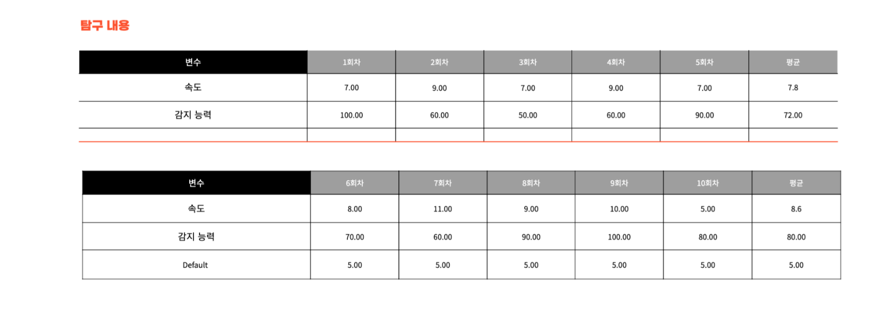
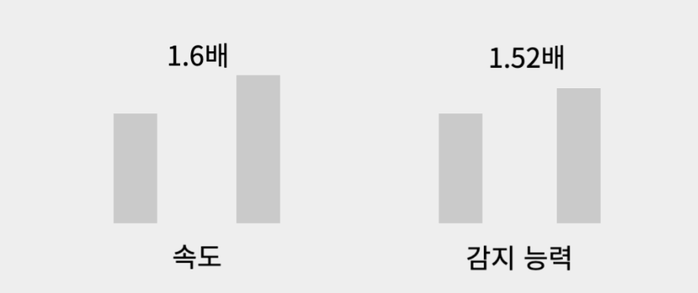

# 환경에 따라서 유전자가 변할까?

## 1. 탐구 동기
시험 공부를 하면서 궁금했던 건데 생명 파트 중 유전 부분에서 유전 형질이 나타나는 과정이 있었다. 서양인의 눈은 파랗고, 동양인의 눈은 거멓다. 환경에 때라서 유전 형질이 나타나는지 알고 싶어서 이 주제를 정하게 되었다.

역사적으로 특정 환경에서 생존과 번식에 유리한 형질이 선택되는 것을 '자연 선택'이라고 하는데 홍채의 색깔의 영향을 끼치는 것은 햇빛 강도라고 할 수 있다. 햇빛이 약한 지역에서는 맬라닌이 적은 눈도 생존과 번식에 불리하지 않습니다. 이는 파란 눈이 더 흔하게 나타날 수 있는 이유일 수 있습니다.

따라서 저는 환경에 따라서 세포는 어떻게 변화할까? 라는 궁금증을 가지게 되었습니다.

## 2. 탐구 문제
: 환경에 따라서 세포는 어떻게 변화할까?
    
    탐구를 하기 위해서 파이썬으로 세포 생존 시뮬레이터를 구현하였다. 환경적 요인을 먹이로 두고 세포들이 움직이면서 먹이를 먹으면 진화하고 진화가 거듭될수롣 먹이를 찾는 능력은 더 높아지게 된다. 그리고 정확도는 높이기 위해서 세포 분열을 구현하였다.

조건:

1. 세대를 거듭할수록 먹이의 개수가 하나씩 줄어든다.
2. 세포 분열할 때 부모의 유전자를 그대로 물려받는다.
3. 진화를 할 때 속도, 감지 능력 중 하나만 진화한다.

## 3. 탐구 활동 과정

### 가설: 진화하면서 속도가 빠르고 감지 능력이 뛰어난 개체들이 살아남을 것이다.

<table>
  <tr>
    <td></td>
    <td></td>
  </tr>
</table>

## 4. 탐구 결과

    여러 요인들을 둠으로써 세포들이 어떻게 하면 살아남을 수 있는지 학습을 시켰고 먹이가 있는 공간에 두었을 때 세포들이 어떻게 변화했는지 알 수 있었다. 먹이를 찾기 위해서 세포들의 속도가 빨라졌으며 시야 감삭 또한 향상되었다는 것을 알 수 있었다. 환경에 따라서 세포가 진화한다는 것을 알 수 있었다.

    가설을 세운 것 처럼 속도가 빠르고 감지 능력이 뛰어나게 진화된 유전자가 선택되는 것을 확인하였다.